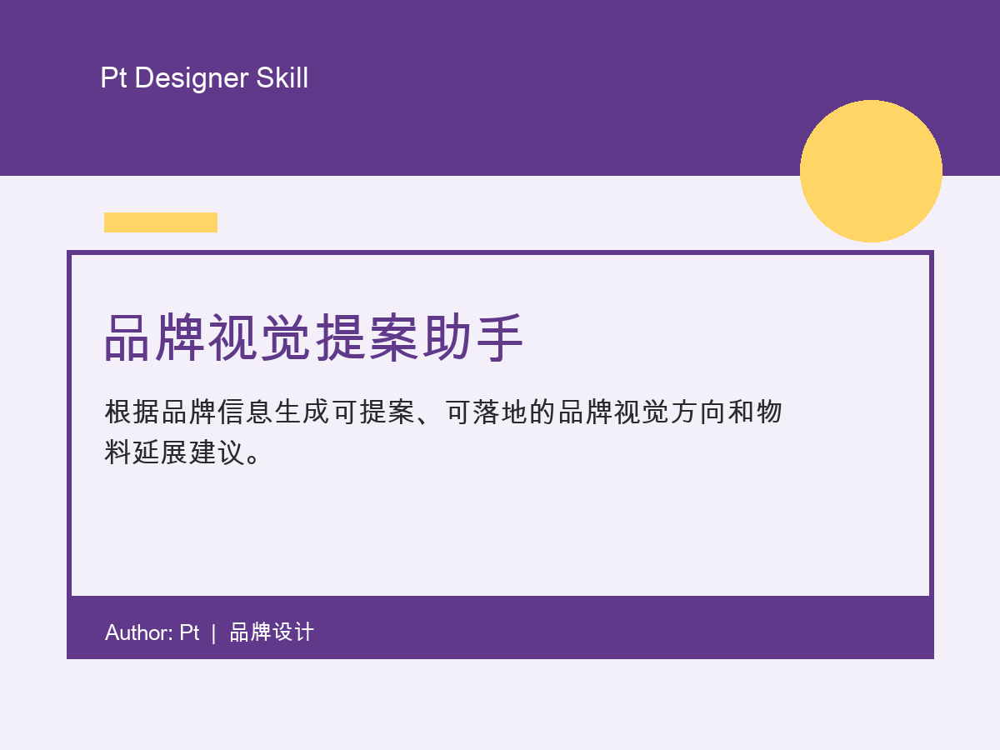

# 品牌视觉提案助手

根据品牌信息生成可提案、可落地的品牌视觉方向和物料延展建议。

## 适合谁

品牌设计师、视觉设计师、设计主管、创意提案人员

## 适用场景

当你要做品牌视觉提案，但还没确定风格方向、关键词、配色和物料延展时使用。

## 输入

品牌名称、行业、产品/服务、目标用户、品牌关键词、希望避免的感觉、竞品或参考、使用场景、必须保留的元素、交付物、预算/周期限制

## 输出

品牌问题判断、视觉方向 A/B/C、推荐方向、提案页结构、可执行清单

## 在线演示

https://2077zpt-source.github.io/pt-zcool-brand-visual-proposal/

## 文件

- `SKILL.md`: skill 主体文件
- `demo.html`: 说明演示页
- `assets/cover.png`: 4:3 展示封面
- `LICENSE`: MIT License

## 作者

Author: Pt  
License: MIT
